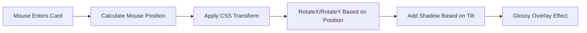
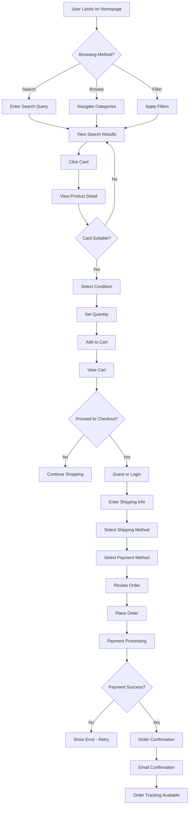
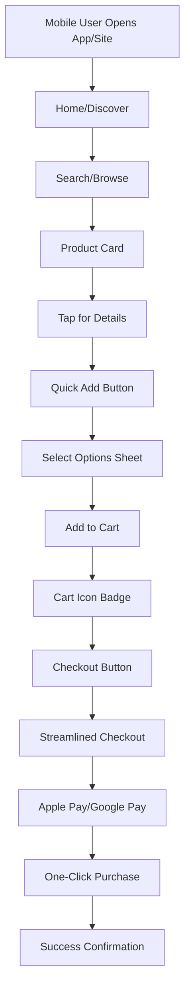
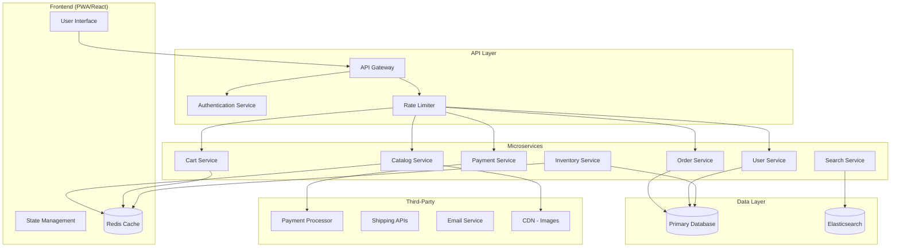

# TCG Vault - Product Requirements Document (PRD)

## Premium Trading Card Game E-Commerce Platform

**Version:** 1.0  
**Date:** March 6, 2026  
**Status:** Draft  
**Prepared by:** Product Management Team

---

## 1. Executive Summary

### 1.1 Purpose

This Product Requirements Document (PRD) defines the specifications for **TCG Vault**, a premium, visually stunning e-commerce platform dedicated to Trading Card Games (TCGs). The platform aims to deliver a superior shopping experience that significantly outperforms traditional TCG stores like Otakku Haven through modern design, advanced interactivity, and optimized performance.

### 1.2 Vision

> "To revolutionize the TCG shopping experience by creating a visually immersive, high-performance platform that makes collecting and purchasing cards as exciting as the games themselves."

### 1.3 Goals

| Goal | Success Metric |
|------|----------------|
| Deliver 3x faster page loads compared to competitor sites | < 2s First Contentful Paint |
| Achieve 95+ Lighthouse Performance Score | Automated testing |
| Implement industry-leading card visual effects | 3D tilt, holo effects on 100% of card images |
| Reduce cart abandonment by 40% | Optimized checkout flow |
| Enable sub-second search results | < 500ms query response |

### 1.4 Target Market

- **Primary:** TCG collectors aged 16-45
- **Secondary:** TCG tournament players seeking competitive cards
- **Tertiary:** Parents purchasing for children

### 1.5 Supported Games (Phase 1)

- Magic: The Gathering (MTG)
- Pokémon TCG
- Yu-Gi-Oh!
- One Piece Card Game
- Future expansion ready

---

## 2. Core Features

### 2.1 User Application

#### 2.1.1 Product Catalog & Browsing

| Feature | Description | Priority |
|---------|-------------|----------|
| Card Gallery | Grid/list view of cards with high-quality images | P0 |
| Box/Pack Display | Display sealed products (boxes, packs, tins) | P0 |
| Quick View | Hover/click to see card details without leaving page | P0 |
| Infinite Scroll | Seamless loading as user browses | P1 |
| Recently Viewed | Track and display recently viewed cards | P1 |
| New Arrivals | Dedicated section for latest additions | P1 |
| Trending Cards | Algorithm-based popular cards display | P2 |

#### 2.1.2 Advanced Filtering System

```
Filter Categories:
├── Game/TCG
│   ├── MTG
│   ├── Pokémon
│   ├── Yu-Gi-Oh!
│   └── One Piece
├── Rarity
│   ├── Common (C)
│   ├── Uncommon (U)
│   ├── Rare (R)
│   ├── Super Rare (SR)
│   ├── Ultra Rare (UR)
│   ├── Secret Rare
│   └── Promotional
├── Element/Type
│   ├── Fire, Water, Earth, Wind (MTG)
│   ├── Fire, Water, Grass, Electric (Pokémon)
│   ├── Monster, Spell, Trap (Yu-Gi-Oh!)
│   └── Character types (One Piece)
├── Card Type
│   ├── Creature/Monster
│   ├── Spell
│   ├── Trap
│   ├── Artifact
│   └── Planewalker/Deck Master
├── Price Range
│   ├── Min-Max slider
│   ├── Preset ranges
│   └── Market price vs. listing price
├── Condition
│   ├── Mint (M)
│   ├── Near Mint (NM)
│   ├── Lightly Played (LP)
│   ├── Moderately Played (MP)
│   ├── Heavily Played (HP)
│   └── Damaged (D)
├── Edition
│   ├── 1st Edition
│   ├── Unlimited
│   ├── Revised
│   └── Post-Revision
├── Set/Expansion
│   └── All available sets per game
├── Language
│   ├── English
│   ├── Japanese
│   ├── Chinese
│   ├── Korean
│   └── Multilingual
└── Foil Status
    ├── Non-Foil
    ├── Foil
    ├── Holo Foil
    └── Reverse Holo
```

#### 2.1.3 Search Functionality

| Feature | Description |
|---------|-------------|
| Instant Search | Real-time results as user types |
| Autocomplete | Suggestions for card names, sets |
| Advanced Search | Boolean operators, filters combination |
| Image Search | Upload card image to find similar |
| Barcode Scan | Scan physical card for quick lookup |

#### 2.1.4 Product Detail Page

**Card Information Display:**
- High-resolution image with zoom capability
- 3D tilt effect on hover (CSS/JS)
- Holo/foil animation effect simulation
- Card name, set, collector number
- Rarity indicator with visual badge
- Current market price + price history chart
- Available quantities by condition
- Card text/effects/abilities
- Artist credit

**Purchase Options:**
- Add to cart (select condition/quantity)
- Add to wishlist
- Compare (side-by-side)
- Buy Now (quick checkout)
- Set price alert

#### 2.1.5 Shopping Cart

| Feature | Description |
|---------|-------------|
| Persistent Cart | Save cart for logged-in users |
| Quantity Adjustment | Update quantities inline |
| Remove Items | Individual and bulk remove |
| Save for Later | Move items to wishlist |
| Cart Notes | Add notes to items |
| Price Validation | Verify prices before checkout |
| Stock Holding | Temporary hold during checkout |

#### 2.1.6 Checkout Process

**Step 1: Cart Review**
- Item summary with images
- Price verification
- Stock availability check
- Apply coupon/promo codes

**Step 2: Shipping Information**
- Guest checkout option
- Saved addresses for logged-in users
- Address validation
- Multiple shipping options:
  - Standard (5-7 days)
  - Express (2-3 days)
  - Overnight (next day)
  - International options

**Step 3: Payment**
- Credit/Debit cards (Visa, Mastercard, Amex)
- PayPal
- Apple Pay / Google Pay
- Bank transfer
- Cash on delivery (optional)

**Step 4: Order Confirmation**
- Order summary
- Estimated delivery
- Order number for tracking
- Email confirmation

#### 2.1.7 Order Tracking

| Feature | Description |
|---------|-------------|
| Order History | List of all past orders |
| Order Details | Full breakdown of each order |
| Status Updates | Real-time tracking status |
| Tracking Integration | Direct carrier tracking links |
| Delivery Estimates | ETA based on carrier data |
| Order Timeline | Visual progress indicator |

#### 2.1.8 Wishlist

| Feature | Description |
|---------|-------------|
| Save Cards | Add cards to wishlist |
| Price Alerts | Notify when price drops |
| Stock Alerts | Notify when back in stock |
| Share Wishlist | Generate shareable link |
| Move to Cart | Quick transfer to cart |
| Organize Lists | Multiple wishlists support |

#### 2.1.9 User Account

| Feature | Description |
|---------|-------------|
| Registration | Email or social login |
| Profile Management | Update personal info |
| Address Book | Multiple shipping addresses |
| Payment Methods | Save cards securely |
| Order History | Complete purchase history |
| Wishlists | Multiple wishlist support |
| Price Alerts | Customized notifications |

#### 2.1.10 Gamification Elements

| Feature | Description |
|---------|-------------|
| Collection Tracker | Track owned cards |
| Spending Badges | Milestone achievements |
| Loyalty Points | Points per purchase |
| Early Access | Early access to new releases |

---

### 2.2 Admin Dashboard

#### 2.2.1 Inventory Management

| Feature | Description | Priority |
|---------|-------------|----------|
| Product Listing | View all cards/products | P0 |
| Add Product | Add new cards manually | P0 |
| Bulk Import | CSV/Excel import | P0 |
| Edit Product | Update card details | P0 |
| Delete Product | Remove from catalog | P0 |
| Stock Management | Track quantities | P0 |
| Condition Tracking | Track per-condition stock | P0 |
| Price Management | Set and adjust prices | P0 |
| Image Management | Upload card images | P0 |
| Barcode Support | UPC/ISBN scanning | P1 |

**Card Metadata Fields:**

| Field | Type | Required |
|-------|------|----------|
| Card Name | Text | Yes |
| Game | Select | Yes |
| Set/Expansion | Select | Yes |
| Collector Number | Text | No |
| Rarity | Select | Yes |
| Card Type | Select | Yes |
| Element/Attribute | Select | Yes |
| Condition | Multi-select | Yes |
| Edition | Select | No |
| Language | Select | Yes |
| Foil Status | Select | Yes |
| Price | Decimal | Yes |
| Quantity | Integer | Yes |
| SKU | Text (auto) | Yes |
| Description | Textarea | No |
| Tags | Tags | No |

#### 2.2.2 Order Management

| Feature | Description |
|---------|-------------|
| Order List | View all orders with filters |
| Order Details | Full order breakdown |
| Order Status Update | Update fulfillment status |
| Shipping Label Generation | Create shipping labels |
| Carrier Integration | Sync with carriers |
| Refund Processing | Handle refunds |
| Order Notes | Internal communication |
| Bulk Actions | Process multiple orders |

**Order Statuses:**
- Pending Payment
- Payment Confirmed
- Processing
- Shipped
- Out for Delivery
- Delivered
- Cancelled
- Refunded
- Partially Refunded

#### 2.2.3 Revenue & Payment Analytics

| Dashboard | Metrics |
|-----------|---------|
| **Sales Overview** | Total revenue, orders, average order value |
| **Sales by Game** | Revenue breakdown by TCG |
| **Sales by Card** | Top selling cards |
| **Sales by Set** | Revenue by expansion |
| **Time Analytics** | Daily/weekly/monthly trends |
| **Customer Analytics** | New vs returning, lifetime value |
| **Inventory Turnover** | Stock movement rates |
| **Price Analysis** | Price adjustments impact |
| **Refund Rate** | Return/refund analytics |

**Report Types:**
- Revenue reports
- Inventory reports
- Customer reports
- Tax reports
- Shipping reports

#### 2.2.4 User Management

| Feature | Description |
|---------|-------------|
| User List | View all customers |
| User Details | Full profile view |
| Order History | Customer's orders |
| Account Status | Enable/disable accounts |
| Notes | Internal admin notes |

#### 2.2.5 Content Management

| Feature | Description |
|---------|-------------|
| Banner Management | Homepage banners |
| Featured Sections | Curated card collections |
| Blog/News | TCG news and articles |
| Page Builder | Static page creation |

#### 2.2.6 Settings & Configuration

| Feature | Description |
|---------|-------------|
| Store Settings | General configuration |
| Shipping Rates | Carrier rate setup |
| Tax Settings | Tax configuration |
| Email Templates | Notification templates |
| Payment Settings | Payment gateway config |

---

## 3. Non-Functional Requirements

### 3.1 Performance Requirements

| Metric | Target | Measurement |
|--------|--------|-------------|
| First Contentful Paint (FCP) | < 1.5s | Lighthouse |
| Largest Contentful Paint (LCP) | < 2.5s | Lighthouse |
| Time to Interactive (TTI) | < 3.5s | Lighthouse |
| First Input Delay (FID) | < 100ms | Lighthouse |
| Cumulative Layout Shift (CLS) | < 0.1 | Lighthouse |
| Page Load Time | < 3s | Real user monitoring |
| Search Response Time | < 500ms | Application metrics |
| API Response Time | < 200ms | Application metrics |
| Image Load Time | < 1s | Application metrics |

### 3.2 SEO Requirements

| Requirement | Implementation |
|-------------|----------------|
| Meta Tags | Dynamic title, description per page |
| Structured Data | Schema.org for products, reviews |
| XML Sitemap | Auto-generated, updated daily |
| Canonical URLs | Prevent duplicate content |
| Open Graph | Social sharing optimization |
| Twitter Cards | Twitter preview support |
| Core Web Vitals | Pass all CWV thresholds |
| URL Structure | SEO-friendly /product/name |
| Image Alt Text | Auto-generated from card data |
| Pagination | Proper rel="next/prev" |

### 3.3 Animation & Visual Effects

#### 3.3.1 Card 3D Tilt Effect



**Technical Implementation:**
- CSS `transform: perspective(1000px) rotateX() rotateY()`
- JavaScript mouse position tracking
- RequestAnimationFrame for smooth updates
- Hardware acceleration via `will-change`

#### 3.3.2 Holo/Foil Effect

| Effect | Description | Technology |
|--------|-------------|-------------|
| Rainbow Holo | Rainbow shimmer on hover | CSS gradient animation |
| Prismatic | Light spectrum shift | CSS filter: hue-rotate |
| Glitter | Sparkle particles | Canvas/WebGL particles |
| Holographic | 3D-like depth | CSS transforms + animation |
| Reverse Holo | Inverse holo pattern | SVG filter animation |

#### 3.3.3 UI Animations

| Element | Animation | Duration | Easing |
|---------|-----------|----------|--------|
| Card Hover | Scale + Shadow | 200ms | ease-out |
| Add to Cart | Bounce + Fly | 400ms | cubic-bezier |
| Page Transitions | Fade + Slide | 300ms | ease-in-out |
| Modal Open | Scale + Fade | 250ms | ease-out |
| Filter Toggle | Slide | 200ms | ease |
| Loading | Pulse/Skeleton | 1500ms | infinite |
| Scroll Reveal | Fade-up | 500ms | ease-out |

### 3.4 Security Requirements

| Requirement | Implementation |
|-------------|----------------|
| HTTPS | TLS 1.3 minimum |
| Data Encryption | AES-256 at rest |
| Payment Security | PCI DSS compliant |
| Input Validation | Server-side + client-side |
| XSS Protection | Content Security Policy |
| CSRF Protection | Anti-CSRF tokens |
| SQL Injection | Parameterized queries |
| Authentication | JWT + refresh tokens |
| Session Management | Secure, expiring sessions |
| Rate Limiting | API request throttling |

### 3.5 Accessibility Requirements

| Standard | Level |
|----------|-------|
| WCAG 2.1 | AA |
| Screen Reader | Full support |
| Keyboard Navigation | Complete |
| Color Contrast | 4.5:1 minimum |
| Focus Indicators | Visible |
| Alt Text | All images |
| ARIA Labels | Interactive elements |

### 3.6 Browser & Device Support

| Browser | Version |
|---------|---------|
| Chrome | 90+ |
| Firefox | 88+ |
| Safari | 14+ |
| Edge | 90+ |
| Mobile Chrome | 90+ |
| Mobile Safari | 14+ |

| Device | Support |
|--------|----------|
| Desktop | Full |
| Tablet (iPad) | Full |
| Mobile | Responsive |
| PWA | Installable |

### 3.7 Scalability Requirements

| Aspect | Requirement |
|--------|-------------|
| Concurrent Users | Support 10,000+ |
| Product Catalog | 100,000+ cards |
| Image Storage | 1M+ images |
| Database | Horizontal scaling |
| CDN | Global distribution |
| Cache | Multi-layer caching |

---

## 4. User Flow for Purchasing a Card

### 4.1 Complete Purchase Flow



### 4.2 Detailed Flow Steps

#### Step 1: Discovery
1. User arrives at homepage via direct URL, search, or social
2. Featured/trending products displayed
3. User can search, browse by game, or use filters

#### Step 2: Product Evaluation
1. User clicks on a card to view details
2. 3D card effect engages on hover
3. User reviews price, condition options, stock
4. User may add to wishlist or compare

#### Step 3: Add to Cart
1. User selects desired condition
2. User sets quantity
3. User clicks "Add to Cart"
4. Animation confirms addition
5. Mini-cart displays in header

#### Step 4: Cart Review
1. User navigates to cart
2. Reviews items, quantities, prices
3. Applies promo codes if available
4. Proceeds to checkout

#### Step 5: Checkout
1. **Authentication:** Guest checkout or login
2. **Shipping:** Enter/select address
3. **Delivery:** Choose shipping method
4. **Payment:** Select and complete payment
5. **Review:** Final order confirmation

#### Step 6: Confirmation
1. Order confirmation page displayed
2. Order number generated
3. Confirmation email sent
4. User can track order status

### 4.3 Mobile Purchase Flow



---

## 5. Technical Architecture Overview

### 5.1 System Components



### 5.2 Technology Stack Recommendation

| Layer | Technology |
|-------|------------|
| Frontend | Next.js / React |
| Styling | Tailwind CSS + Framer Motion |
| State | Zustand / Redux Toolkit |
| API | GraphQL + REST |
| Database | PostgreSQL |
| Cache | Redis |
| Search | Elasticsearch / Algolia |
| Images | Cloudinary / AWS CloudFront |
| Auth | NextAuth / Auth0 |
| Payments | Stripe |
| Shipping | Shippo / EasyPost |
| Email | SendGrid / Resend |
| Hosting | Vercel / AWS |

---

## 6. Success Metrics & KPIs

### 6.1 Business Metrics

| KPI | Target (Year 1) |
|-----|-----------------|
| Monthly Active Users | 50,000 |
| Conversion Rate | 4% |
| Average Order Value | $85 |
| Customer Lifetime Value | $350 |
| Cart Abandonment Rate | < 55% |
| Customer Satisfaction | > 4.5/5 |

### 6.2 Technical Metrics

| KPI | Target |
|-----|--------|
| Uptime | 99.9% |
| Page Load Time | < 2s |
| Error Rate | < 0.1% |
| Lighthouse Score | 95+ |
| Core Web Vitals | All "Good" |

---

## 7. Roadmap

### Phase 1: MVP (Months 1-4)
- [ ] Core catalog with basic filtering
- [ ] Product detail with card effects
- [ ] Shopping cart
- [ ] Basic checkout (guest + registered)
- [ ] User accounts
- [ ] Admin dashboard (basic inventory + orders)
- [ ] Payment integration (Stripe)

### Phase 2: Enhanced Features (Months 5-8)
- [ ] Advanced filtering
- [ ] Search enhancements
- [ ] Order tracking
- [ ] Wishlists
- [ ] Price alerts
- [ ] Admin analytics
- [ ] Multiple shipping carriers

### Phase 3: Premium Experience (Months 9-12)
- [ ] 3D card viewer
- [ ] Advanced holo effects
- [ ] Mobile app
- [ ] Loyalty program
- [ ] Social features
- [ ] Marketplace for users

---

## 8. Appendix

### 8.1 Glossary

| Term | Definition |
|------|------------|
| TCG | Trading Card Game |
| FCP | First Contentful Paint |
| LCP | Largest Contentful Paint |
| CLS | Cumulative Layout Shift |
| SKU | Stock Keeping Unit |
| PCI DSS | Payment Card Industry Data Security Standard |
| CDN | Content Delivery Network |

### 8.2 References

- Competitor Analysis: Otakku Haven, TCGPlayer, Cardmarket
- Industry Standards: WCAG 2.1, PCI DSS
- Performance: Google Lighthouse, Web Vitals

---

*Document Version: 1.0*  
*Last Updated: March 6, 2026*  
*Next Review: TBD*
