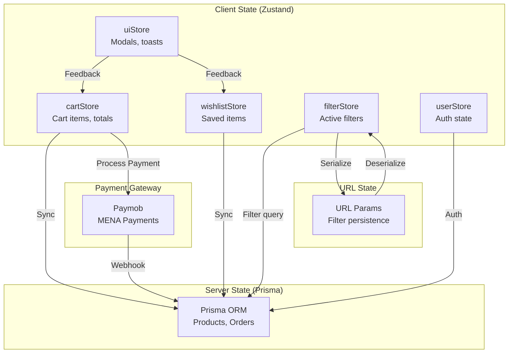
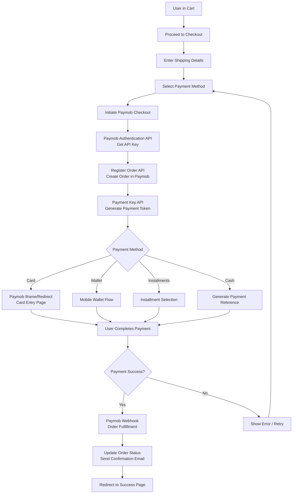

# TCG Vault - Technical Architecture Blueprint

> **Version:** 1.0  
> **Date:** March 6, 2026  
> **Status:** Ready for Implementation  
> **Tech Stack:** Next.js 14+ (App Router), Tailwind CSS, Framer Motion, Zustand, Prisma ORM, Paymob (MENA Payment Gateway)

---

## 1. Recommended Folder Structure

### Overview

```
tcg-vault/
├── .github/                    # GitHub Actions CI/CD
├── .vscode/                    # VS Code settings
├── public/                     # Static assets
│   ├── fonts/                  # Custom fonts
│   ├── icons/                  # SVG icons
│   ├── images/                 # Static images (logos, banners)
│   └── videos/                 # Promo videos
├── src/
│   ├── app/                    # Next.js App Router
│   │   ├── (auth)/             # Auth route group
│   │   │   ├── login/
│   │   │   ├── register/
│   │   │   └── forgot-password/
│   │   ├── (shop)/             # Customer-facing routes
│   │   │   ├── layout.tsx      # Shop layout (header, footer)
│   │   │   ├── page.tsx       # Homepage
│   │   │   ├── products/
│   │   │   │   ├── page.tsx    # Product listing/browse
│   │   │   │   └── [slug]/
│   │   │   │       └── page.tsx # Product detail page
│   │   │   ├── cart/
│   │   │   │   └── page.tsx    # Cart page
│   │   │   ├── checkout/
│   │   │   │   └── page.tsx    # Checkout flow
│   │   │   ├── wishlist/
│   │   │   │   └── page.tsx    # Wishlist page
│   │   │   ├── account/
│   │   │   │   ├── page.tsx    # Account dashboard
│   │   │   │   ├── orders/
│   │   │   │   ├── addresses/
│   │   │   │   └── settings/
│   │   │   ├── search/
│   │   │   │   └── page.tsx    # Search results
│   │   │   └── [game]/         # Game-specific routes
│   │   │       ├── page.tsx    # Game landing page
│   │   │       └── sets/
│   │   ├── (admin)/            # Admin routes (protected)
│   │   │   ├── layout.tsx      # Admin layout (sidebar, header)
│   │   │   ├── dashboard/
│   │   │   │   └── page.tsx    # Admin dashboard
│   │   │   ├── products/
│   │   │   │   ├── page.tsx    # Product list
│   │   │   │   ├── new/
│   │   │   │   └── [id]/
│   │   │   │       └── edit/
│   │   │   ├── orders/
│   │   │   │   ├── page.tsx    # Order management
│   │   │   │   └── [id]/
│   │   │   ├── customers/
│   │   │   ├── analytics/
│   │   │   ├── inventory/
│   │   │   ├── content/
│   │   │   │   ├── banners/
│   │   │   │   └── pages/
│   │   │   └── settings/
│   │   ├── api/                # API Routes
│   │   │   ├── auth/
│   │   │   ├── products/
│   │   │   ├── orders/
│   │   │   ├── payments/
│   │   │   └── webhooks/
│   │   ├── layout.tsx          # Root layout
│   │   └── globals.css         # Global styles
│   ├── components/             # Shared components
│   │   ├── ui/                 # Base UI primitives
│   │   │   ├── Button.tsx
│   │   │   ├── Card.tsx
│   │   │   ├── Input.tsx
│   │   │   ├── Select.tsx
│   │   │   ├── Modal.tsx
│   │   │   ├── Drawer.tsx
│   │   │   ├── Badge.tsx
│   │   │   ├── Avatar.tsx
│   │   │   ├── Skeleton.tsx
│   │   │   ├── Toast.tsx
│   │   │   └── Tooltip.tsx
│   │   ├── layout/             # Layout components
│   │   │   ├── Header.tsx
│   │   │   ├── Footer.tsx
│   │   │   ├── Sidebar.tsx
│   │   │   ├── Navigation.tsx
│   │   │   └── AdminLayout.tsx
│   │   ├── tcg/                # TCG-specific components
│   │   │   ├── TCGCardItem.tsx      # Card with 3D tilt
│   │   │   ├── TCGCardGrid.tsx      # Card grid layout
│   │   │   ├── ProductCard.tsx      # Product card
│   │   │   ├── ProductGallery.tsx  # Image gallery
│   │   │   ├── CardTiltEffect.tsx   # 3D tilt logic
│   │   │   ├── HoloEffect.tsx       # Foil/holo effect
│   │   │   ├── PriceDisplay.tsx    # Price with trends
│   │   │   ├── ConditionBadge.tsx  # Card condition
│   │   │   ├── RarityBadge.tsx     # Rarity indicator
│   │   │   ├── GameFilter.tsx      # Game selection
│   │   │   ├── SetSelector.tsx     # Set dropdown
│   │   │   └── CardSearch.tsx      # Search with autocomplete
│   │   ├── cart/               # Cart components
│   │   │   ├── CartDrawer.tsx      # Slide-out cart
│   │   │   ├── CartItem.tsx        # Cart line item
│   │   │   ├── CartSummary.tsx     # Totals display
│   │   │   ├── CartEmpty.tsx       # Empty state
│   │   │   └── CheckoutForm.tsx    # Checkout forms
│   │   ├── filters/            # Filter components
│   │   │   ├── FilterSidebar.tsx  # Main filter panel
│   │   │   ├── FilterSection.tsx  # Individual filter
│   │   │   ├── PriceRangeSlider.tsx
│   │   │   ├── ConditionFilter.tsx
│   │   │   ├── RarityFilter.tsx
│   │   │   ├── LanguageFilter.tsx
│   │   │   ├── FoilFilter.tsx
│   │   │   └── ActiveFilters.tsx   # Active filter chips
│   │   ├── forms/              # Form components
│   │   │   ├── CheckoutForm.tsx
│   │   │   ├── AddressForm.tsx
│   │   │   ├── ProductForm.tsx    # Admin product form
│   │   │   └── SearchForm.tsx
│   │   └── admin/              # Admin-specific
│   │       ├── DataTable.tsx
│   │       ├── StatsCard.tsx
│   │       ├── OrderTimeline.tsx
│   │       └── ProductBulkActions.tsx
│   ├── lib/                    # Utilities & configs
│   │   ├── prisma/             # Prisma client & queries
│   │   │   ├── client.ts       # Prisma client singleton
│   │   │   ├── index.ts        # Export all Prisma queries
│   │   │   └── /queries/       # Organized query functions
│   │   │       ├── productQueries.ts
│   │   │       ├── orderQueries.ts
│   │   │       ├── userQueries.ts
│   │   │       └── cartQueries.ts
│   │   ├── paymob/             # Paymob payment integration
│   │   │   ├── client.ts       # Paymob API client
│   │   │   ├── types.ts         # Paymob type definitions
│   │   │   ├── checkout.ts     # Checkout flow helpers
│   │   │   └── webhook.ts      # Webhook handlers
│   │   ├── utils.ts            # General utilities
│   │   ├── constants.ts        # App constants
│   │   └── hooks/              # Custom hooks
│   │       ├── useCart.ts
│   │       ├── useWishlist.ts
│   │       ├── useProduct.ts
│   │       ├── useTilt.ts       # 3D tilt hook
│   │       └── useDebounce.ts
│   ├── stores/                 # Zustand stores
│   │   ├── cartStore.ts
│   │   ├── wishlistStore.ts
│   │   ├── filterStore.ts
│   │   ├── userStore.ts
│   │   └── uiStore.ts          # UI state (modals, drawers)
│   ├── types/                  # TypeScript types
│   │   ├── product.ts
│   │   ├── cart.ts
│   │   ├── user.ts
│   │   ├── order.ts
│   │   └── index.ts
│   ├── styles/                 # Styles
│   │   └── animations.ts       # Framer Motion variants
│   └── data/                   # Static/mock data
│       ├── games.ts
│       ├── sets.ts
│       └── filters.ts
├── .env.example
├── .eslintrc.json
├── .prettierrc
├── next.config.js
├── package.json
├── postcss.config.js
├── tailwind.config.ts
├── tsconfig.json
└── README.md
```

### Route Groupings Explained

| Group | Purpose | Layout |
|-------|---------|--------|
| `(auth)` | Login, register, password reset | Minimal layout (no header/footer) |
| `(shop)` | Customer-facing store | Full shop layout with header/footer |
| `(admin)` | Admin dashboard | Admin sidebar layout |

---

## 2. Design System Overview

### 2.1 Color Palette (Premium Gaming Feel)

```css
:root {
  /* ============================================
     PRIMARY COLORS - Deep Space Gaming Theme
     ============================================ */
  
  /* Primary - Cosmic Purple */
  --primary-50: #f5f3ff;   /* Lightest */
  --primary-100: #ede9fe;
  --primary-200: #ddd6fe;
  --primary-300: #c4b5fd;
  --primary-400: #a78bfa;
  --primary-500: #8b5cf6;   /* Base primary */
  --primary-600: #7c3aed;
  --primary-700: #6d28d9;
  --primary-800: #5b21b6;
  --primary-900: #4c1d95;  /* Darkest */
  
  /* Secondary - Neon Cyan */
  --secondary-50: #ecfeff;
  --secondary-100: #cffafe;
  --secondary-200: #a5f3fc;
  --secondary-300: #67e8f9;
  --secondary-400: #22d3ee;
  --secondary-500: #06b6d4;   /* Base secondary */
  --secondary-600: #0891b2;
  --secondary-700: #0e7490;
  --secondary-800: #155e75;
  --secondary-900: #164e63;
  
  /* Accent - Holographic Gold */
  --accent-50: #fffbeb;
  --accent-100: #fef3c7;
  --accent-200: #fde68a;
  --accent-300: #fcd34d;
  --accent-400: #fbbf24;
  --accent-500: #f59e0b;   /* Base accent */
  --accent-600: #d97706;
  --accent-700: #b45309;
  --accent-800: #92400e;
  --accent-900: #78350f;

  /* ============================================
     NEUTRAL COLORS - Dark Mode Base
     ============================================ */
  
  /* Background - Deep Space */
  --bg-primary: #0a0a0f;      /* Main background */
  --bg-secondary: #12121a;    /* Cards, panels */
  --bg-tertiary: #1a1a24;    /* Elevated surfaces */
  --bg-hover: #22222e;        /* Hover states */
  
  /* Surface - Glass Effect */
  --surface-glass: rgba(255, 255, 255, 0.03);
  --surface-glass-hover: rgba(255, 255, 255, 0.06);
  --surface-glass-border: rgba(255, 255, 255, 0.08);
  
  /* Text */
  --text-primary: #fafafa;   /* Primary text */
  --text-secondary: #a1a1aa;  /* Secondary text */
  --text-tertiary: #71717a;  /* Muted text */
  --text-inverse: #0a0a0f;   /* Text on light bg */

  /* ============================================
     SEMANTIC COLORS
     ============================================ */
  
  /* Success - Emerald */
  --success: #10b981;
  --success-bg: rgba(16, 185, 129, 0.1);
  
  /* Warning - Amber */
  --warning: #f59e0b;
  --warning-bg: rgba(245, 158, 11, 0.1);
  
  /* Error - Rose */
  --error: #f43f5e;
  --error-bg: rgba(244, 63, 94, 0.1);
  
  /* Info - Sky */
  --info: #0ea5e9;
  --info-bg: rgba(14, 165, 233, 0.1);

  /* ============================================
     RARITY COLORS - TCG Specific
     ============================================ */
  
  /* Card Rarity */
  --rarity-common: #9ca3af;      /* Gray */
  --rarity-uncommon: #22c55e;    /* Green */
  --rarity-rare: #3b82f6;        /* Blue */
  --rarity-super-rare: #a855f7; /* Purple */
  --rarity-ultra-rare: #f59e0b; /* Orange/Gold */
  --rarity-secret-rare: #ec4899; /* Pink */
  --rarity-promotional: #ef4444; /* Red */

  /* ============================================
     CONDITION COLORS
     ============================================ */
  
  --condition-mint: #10b981;         /* Green */
  --condition-near-mint: #22c55e;    /* Light Green */
  --condition-lightly-played: #84cc16; /* Lime */
  --condition-moderately-played: #eab308; /* Yellow */
  --condition-heavily-played: #f97316; /* Orange */
  --condition-damaged: #ef4444;      /* Red */

  /* ============================================
     GRADIENTS & EFFECTS
     ============================================ */
  
  /* Card Shine Effects */
  --gradient-holo: linear-gradient(
    135deg,
    rgba(255, 0, 128, 0.3) 0%,
    rgba(255, 255, 0, 0.3) 25%,
    rgba(0, 255, 255, 0.3) 50%,
    rgba(255, 0, 255, 0.3) 75%,
    rgba(255, 0, 128, 0.3) 100%
  );
  
  --gradient-rainbow: linear-gradient(
    90deg,
    #ff0000, #ff7f00, #ffff00, #00ff00, #0000ff, #4b0082, #9400d3
  );
  
  /* Glass Effect */
  --glass-bg: rgba(18, 18, 26, 0.8);
  --glass-border: 1px solid rgba(255, 255, 255, 0.1);
  --glass-blur: blur(12px);
  
  /* Shadows */
  --shadow-sm: 0 1px 2px rgba(0, 0, 0, 0.3);
  --shadow-md: 0 4px 6px -1px rgba(0, 0, 0, 0.4);
  --shadow-lg: 0 10px 15px -3px rgba(0, 0, 0, 0.5);
  --shadow-xl: 0 20px 25px -5px rgba(0, 0, 0, 0.6);
  --shadow-card: 0 8px 32px rgba(0, 0, 0, 0.4);
  --shadow-glow-primary: 0 0 20px rgba(139, 92, 246, 0.3);
  --shadow-glow-accent: 0 0 20px rgba(245, 158, 11, 0.3);
}
```

### 2.2 Typography

```css
:root {
  /* ============================================
     FONTS - Premium Gaming Typography
     ============================================ */
  
  /* Display/Headings - Bold Gaming Feel */
  --font-display: 'Orbitron', 'Rajdhani', sans-serif;
  
  /* Body Text - Highly Readable */
  --font-body: 'Inter', 'Plus Jakarta Sans', sans-serif;
  
  /* Mono - Code/Prices */
  --font-mono: 'JetBrains Mono', 'Fira Code', monospace;

  /* ============================================
     FONT SIZES
     ============================================ */
  
  --text-xs: 0.75rem;      /* 12px */
  --text-sm: 0.875rem;     /* 14px */
  --text-base: 1rem;       /* 16px */
  --text-lg: 1.125rem;    /* 18px */
  --text-xl: 1.25rem;      /* 20px */
  --text-2xl: 1.5rem;      /* 24px */
  --text-3xl: 1.875rem;    /* 30px */
  --text-4xl: 2.25rem;     /* 36px */
  --text-5xl: 3rem;        /* 48px */
  --text-6xl: 3.75rem;     /* 60px */
  --text-7xl: 4.5rem;      /* 72px */

  /* ============================================
     FONT WEIGHTS
     ============================================ */
  
  --font-light: 300;
  --font-normal: 400;
  --font-medium: 500;
  --font-semibold: 600;
  --font-bold: 700;
  --font-extrabold: 800;

  /* ============================================
     LINE HEIGHTS
     ============================================ */
  
  --leading-none: 1;
  --leading-tight: 1.25;
  --leading-snug: 1.375;
  --leading-normal: 1.5;
  --leading-relaxed: 1.625;
  --leading-loose: 2;
}
```

### 2.3 Spacing System

```css
:root {
  --space-0: 0;
  --space-1: 0.25rem;   /* 4px */
  --space-2: 0.5rem;    /* 8px */
  --space-3: 0.75rem;   /* 12px */
  --space-4: 1rem;      /* 16px */
  --space-5: 1.25rem;   /* 20px */
  --space-6: 1.5rem;    /* 24px */
  --space-8: 2rem;      /* 32px */
  --space-10: 2.5rem;   /* 40px */
  --space-12: 3rem;     /* 48px */
  --space-16: 4rem;     /* 64px */
  --space-20: 5rem;     /* 80px */
  --space-24: 6rem;     /* 96px */
}
```

### 2.4 Border Radius

```css
:root {
  --radius-none: 0;
  --radius-sm: 0.125rem;   /* 2px */
  --radius DEFAULT: 0.25rem;  /* 4px */
  --radius-md: 0.375rem;   /* 6px */
  --radius-lg: 0.5rem;      /* 8px */
  --radius-xl: 0.75rem;     /* 12px */
  --radius-2xl: 1rem;       /* 16px */
  --radius-3xl: 1.5rem;     /* 24px */
  --radius-full: 9999px;    /* Pill/Circle */
}
```

---

## 3. Reusable UI Components (Priority List)

### Priority 1 - Core Components (Build First)

| Component | Description | File | Dependencies |
|-----------|-------------|------|--------------|
| **TCGCardItem** | Card with 3D tilt effect, holo shimmer | `components/tcg/TCGCardItem.tsx` | Framer Motion, useTilt hook |
| **Button** | Primary, secondary, ghost, danger variants | `components/ui/Button.tsx` | Tailwind classes |
| **Card** | Glass-effect card container | `components/ui/Card.tsx` | Tailwind, CSS variables |
| **Input** | Form input with validation states | `components/ui/Input.tsx` | React Hook Form |
| **Modal** | Accessible modal dialog | `components/ui/Modal.tsx` | Framer Motion |
| **Drawer** | Slide-out panels (cart, filters) | `components/ui/Drawer.tsx` | Framer Motion |
| **Badge** | Status, rarity, condition badges | `components/ui/Badge.tsx` | CSS variables |
| **Skeleton** | Loading placeholders | `components/ui/Skeleton.tsx` | Tailwind |
| **FilterSidebar** | Collapsible filter panel | `components/filters/FilterSidebar.tsx` | Filter components |
| **CartDrawer** | Slide-out shopping cart | `components/cart/CartDrawer.tsx` | Zustand cartStore |

### Priority 2 - Feature Components

| Component | Description | File | Dependencies |
|-----------|-------------|------|--------------|
| **ProductCard** | Product listing card | `components/tcg/ProductCard.tsx` | TCGCardItem |
| **ProductGallery** | Image gallery with zoom | `components/tcg/ProductGallery.tsx` | Framer Motion |
| **PriceDisplay** | Price with market comparison | `components/tcg/PriceDisplay.tsx` | Chart library |
| **ConditionBadge** | Card condition indicator | `components/tcg/ConditionBadge.tsx` | Badge |
| **RarityBadge** | Rarity with glow effect | `components/tcg/RarityBadge.tsx` | Badge, CSS variables |
| **HoloEffect** | Foil/holo animation overlay | `components/tcg/HoloEffect.tsx` | CSS animations |
| **CartItem** | Cart line item with quantity | `components/cart/CartItem.tsx` | ProductCard |
| **CartSummary** | Cart totals display | `components/cart/CartSummary.tsx` | - |
| **PriceRangeSlider** | Dual-thumb price slider | `components/filters/PriceRangeSlider.tsx` | Radix UI |
| **CardSearch** | Search with autocomplete | `components/tcg/CardSearch.tsx` | - |

### Priority 3 - Enhanced Components

| Component | Description | File | Dependencies |
|-----------|-------------|------|--------------|
| **ProductGrid** | Masonry/grid layout | `components/tcg/ProductGrid.tsx` | - |
| **QuickView** | Hover quick view modal | `components/tcg/QuickView.tsx` | Modal |
| **PriceChart** | Historical price chart | `components/tcg/PriceChart.tsx` | Recharts |
| **ActiveFilters** | Filter chips display | `components/filters/ActiveFilters.tsx` | Badge |
| **OrderTimeline** | Order status timeline | `components/admin/OrderTimeline.tsx` | Framer Motion |
| **DataTable** | Admin data table | `components/admin/DataTable.tsx` | TanStack Table |

---

## 4. State Management Architecture (Zustand)

### 4.1 Store Structure

```
stores/
├── cartStore.ts         # Shopping cart state
├── wishlistStore.ts    # Wishlist state
├── filterStore.ts      # Product filters
├── userStore.ts        # User authentication
├── uiStore.ts          # UI state (modals, drawers)
└── index.ts            # Store exports
```

### 4.2 Cart Store (`cartStore.ts`)

```typescript
// ============================================
// CART STORE - Primary Shopping Cart State
// ============================================

interface CartItem {
  id: string;
  variantId: string;
  productId: string;
  name: string;
  image: string;
  condition: CardCondition;
  language: CardLanguage;
  foilStatus: FoilStatus;
  price: number;
  quantity: number;
  maxQuantity: number;  // Available stock
}

interface CartState {
  // State
  items: CartItem[];
  isOpen: boolean;           // Cart drawer open
  
  // Computed (via getters)
  itemCount: number;
  subtotal: number;
  isEmpty: boolean;
  
  // Actions
  addItem: (item: Omit<CartItem, 'id'>) => void;
  removeItem: (variantId: string) => void;
  updateQuantity: (variantId: string, quantity: number) => void;
  clearCart: () => void;
  toggleCart: () => void;
  openCart: () => void;
  closeCart: () => void;
  
  // Async actions (sync with backend)
  syncCart: () => Promise<void>;
  applyCoupon: (code: string) => Promise<boolean>;
}
```

### 4.3 Wishlist Store (`wishlistStore.ts`)

```typescript
// ============================================
// WISHLIST STORE - Saved Items State
// ============================================

interface WishlistItem {
  id: string;
  productId: string;
  variantId?: string;
  name: string;
  image: string;
  price: number;
  addedAt: Date;
  priceAlert?: number;  // Notify when below this price
}

interface WishlistState {
  items: WishlistItem[];
  isLoading: boolean;
  
  // Computed
  itemCount: number;
  
  // Actions
  addItem: (item: Omit<WishlistItem, 'id' | 'addedAt'>) => void;
  removeItem: (productId: string, variantId?: string) => void;
  setPriceAlert: (productId: string, price: number) => void;
  clearWishlist: () => void;
  
  // Async
  loadWishlist: () => Promise<void>;
  syncWishlist: () => Promise<void>;
}
```

### 4.4 Filter Store (`filterStore.ts`)

```typescript
// ============================================
// FILTER STORE - Product Filtering State
// ============================================

interface FilterState {
  // Active filters
  game: string | null;
  set: string | null;
  search: string;
  
  // Card filters
  rarity: CardRarity[];
  condition: CardCondition[];
  language: CardLanguage[];
  foilStatus: FoilStatus[];
  cardType: string[];
  attribute: string[];
  
  // Price
  priceMin: number | null;
  priceMax: number | null;
  
  // Sort
  sortBy: 'relevance' | 'price_asc' | 'price_desc' | 'name' | 'newest' | 'popularity';
  
  // UI
  isFilterOpen: boolean;    // Mobile filter drawer
  activeFilterCount: number;
  
  // Actions
  setGame: (game: string | null) => void;
  setSet: (set: string | null) => void;
  setSearch: (search: string) => void;
  
  toggleRarity: (rarity: CardRarity) => void;
  toggleCondition: (condition: CardCondition) => void;
  toggleLanguage: (language: CardLanguage) => void;
  toggleFoilStatus: (status: FoilStatus) => void;
  toggleCardType: (type: string) => void;
  toggleAttribute: (attr: string) => void;
  
  setPriceRange: (min: number | null, max: number | null) => void;
  setSortBy: (sort: FilterState['sortBy']) => void;
  
  clearFilters: () => void;
  clearGameFilter: () => void;
  
  toggleFilterDrawer: () => void;
  
  // Serialization (for URL params)
  toQueryParams: () => string;
  fromQueryParams: (params: URLSearchParams) => void;
}
```

### 4.5 UI Store (`uiStore.ts`)

```typescript
// ============================================
// UI STORE - Global UI State
// ============================================

type ToastType = 'success' | 'error' | 'warning' | 'info';

interface Toast {
  id: string;
  type: ToastType;
  title: string;
  message?: string;
  duration?: number;
}

interface UIState {
  // Drawers
  isCartOpen: boolean;
  isFilterOpen: boolean;
  isMobileMenuOpen: boolean;
  
  // Modals
  quickViewProduct: Product | null;
  loginModalOpen: boolean;
  
  // Toast notifications
  toasts: Toast[];
  
  // Theme
  theme: 'dark' | 'light' | 'system';
  
  // Actions
  openCart: () => void;
  closeCart: () => void;
  toggleCart: () => void;
  
  openFilter: () => void;
  closeFilter: () => void;
  
  toggleMobileMenu: () => void;
  closeMobileMenu: () => void;
  
  openQuickView: (product: Product) => void;
  closeQuickView: () => void;
  
  openLoginModal: () => void;
  closeLoginModal: () => void;
  
  addToast: (toast: Omit<Toast, 'id'>) => void;
  removeToast: (id: string) => void;
  
  setTheme: (theme: UIState['theme']) => void;
}
```

### 4.6 User Store (`userStore.ts`)

```typescript
// ============================================
// USER STORE - Authentication State
// ============================================

interface UserAddress {
  id: string;
  name: string;
  street: string;
  city: string;
  state: string;
  postalCode: string;
  country: string;
  isDefault: boolean;
}

interface User {
  id: string;
  email: string;
  firstName: string;
  lastName: string;
  avatar?: string;
  role: 'ADMIN' | 'CUSTOMER';
  addresses: UserAddress[];
  loyaltyPoints: number;
}

interface UserState {
  user: User | null;
  isAuthenticated: boolean;
  isLoading: boolean;
  
  // Auth actions
  login: (email: string, password: string) => Promise<void>;
  register: (data: RegisterData) => Promise<void>;
  logout: () => void;
  
  // User actions
  updateProfile: (data: Partial<User>) => Promise<void>;
  addAddress: (address: Omit<UserAddress, 'id'>) => Promise<void>;
  
  // Session
  checkAuth: () => Promise<void>;
}
```

### 4.7 State Architecture Diagram



---

## 5. Animation Strategy (Framer Motion)

### 5.1 Card 3D Tilt Effect

```typescript
// useTilt hook pattern
const useTilt = (ref: RefObject<HTMLElement>) => {
  const [rotate, setRotate] = useState({ x: 0, y: 0 });
  
  const handleMouseMove = (e: MouseEvent) => {
    const rect = ref.current?.getBoundingClientRect();
    if (!rect) return;
    
    const x = e.clientX - rect.left;
    const y = e.clientY - rect.top;
    
    const centerX = rect.width / 2;
    const centerY = rect.height / 2;
    
    const rotateX = ((y - centerY) / centerY) * -10; // Max 10deg
    const rotateY = ((x - centerX) / centerX) * 10;
    
    setRotate({ x: rotateX, y: rotateY });
  };
  
  return { rotate, handleMouseMove };
};
```

### 5.2 Key Animations

| Animation | Variant | Duration | Easing |
|-----------|---------|----------|--------|
| Card Hover | `scale: 1.02, shadowLg` | 200ms | `easeOut` |
| Card Tilt | `rotateX, rotateY` | 100ms | `easeOut` |
| Add to Cart | `scale: [1, 1.2, 1]` + position | 400ms | `spring` |
| Page Enter | `fadeIn, slideY(20)` | 300ms | `easeOut` |
| Modal Open | `scale: [0.9, 1], opacity: [0, 1]` | 250ms | `easeOut` |
| Drawer Slide | `x: -100% → 0%` | 300ms | `easeOut` |
| Filter Toggle | `height: 0 → auto` | 200ms | `easeInOut` |
| Skeleton Pulse | `opacity: [0.5, 1]` | 1500ms | `easeInOut`, loop |

---

## 6. Paymob Payment Integration Architecture

### 6.1 Paymob Overview

Paymob is a comprehensive payment solution serving the MENA region, supporting:
- Credit/Debit Cards (Visa, Mastercard, Amex)
- Mobile Wallets (M-Pesa, Vodafone Cash, Etisalat Cash)
- Bank Installments ( valu, Bank Misr, etc.)
- Bank Transfers (Fawry, QNB, Alex Bank)
- Cash on Delivery

### 6.2 Paymob Integration Flow



### 6.3 Paymob API Integration Steps

| Step | API Endpoint | Purpose | Payload |
|------|--------------|---------|--------|
| 1 | `/auth/tokens` | Obtain API key | `api_id` |
| 2 | `/orders` | Register order | `amount`, `currency`, `items` |
| 3 | `/payment/keys` | Generate payment key | `order_id`, `amount`, `payment_methods` |
| 4 | `/iframe` or `/redirect` | Display payment page | `payment_key` |
| 5 | Webhook | Handle async payment confirmation | `obj` (order payload) |

### 6.4 Paymob Environment Configuration

```typescript
// lib/paymob/config.ts

export const paymobConfig = {
  // Sandbox (Test) Environment
  sandbox: {
    baseUrl: 'https://accept.paymobsolutions.com',
    apiKey: process.env.PAYMOB_SANDBOX_API_KEY,
    merchantId: process.env.PAYMOB_SANDBOX_MERCHANT_ID,
    iframeId: process.env.PAYMOB_SANDBOX_IFRAME_ID,
    integrationId: process.env.PAYMOB_SANDBOX_INTEGRATION_ID,
    webhookSecret: process.env.PAYMOB_SANDBOX_WEBHOOK_SECRET,
  },
  // Production Environment
  production: {
    baseUrl: 'https://accept.paymobsolutions.com',
    apiKey: process.env.PAYMOB_PRODUCTION_API_KEY,
    merchantId: process.env.PAYMOB_PRODUCTION_MERCHANT_ID,
    iframeId: process.env.PAYMOB_PRODUCTION_IFRAME_ID,
    integrationId: process.env.PAYMOB_PRODUCTION_INTEGRATION_ID,
    webhookSecret: process.env.PAYMOB_PRODUCTION_WEBHOOK_SECRET,
  },
};

export type PaymobEnvironment = 'sandbox' | 'production';
```

### 6.5 Paymob Client Implementation

```typescript
// lib/paymob/client.ts

interface PaymobAuthResponse {
  token: string;
  expires_in: number;
}

interface PaymobOrderResponse {
  id: number;  // Paymob order ID
  created_at: string;
}

interface PaymobPaymentKeyResponse {
  token: string;  // Payment key token
  expires_in: number;
}

class PaymobClient {
  private apiKey: string;
  private baseUrl: string;
  private merchantId: string;
  
  constructor(env: PaymobEnvironment = 'sandbox') {
    const config = paymobConfig[env];
    this.apiKey = config.apiKey;
    this.baseUrl = config.baseUrl;
    this.merchantId = config.merchantId;
  }
  
  // Step 1: Authentication - Get API Token
  async authenticate(): Promise<PaymobAuthResponse> {
    const response = await fetch(`${this.baseUrl}/auth/tokens`, {
      method: 'POST',
      headers: { 'Content-Type': 'application/json' },
      body: JSON.stringify({ api_key: this.apiKey }),
    });
    return response.json();
  }
  
  // Step 2: Register Order - Create order in Paymob
  async registerOrder(
    authToken: string,
    amount: number,
    currency: string = 'EGP',
    items: PaymobItem[]
  ): Promise<PaymobOrderResponse> {
    const response = await fetch(`${this.baseUrl}/orders`, {
      method: 'POST',
      headers: {
        'Content-Type': 'application/json',
        'Authorization': `Bearer ${authToken}`,
      },
      body: JSON.stringify({
        merchant_id: this.merchantId,
        amount_cents: Math.round(amount * 100), // Paymob uses cents
        currency,
        items,
      }),
    });
    return response.json();
  }
  
  // Step 3: Generate Payment Key
  async generatePaymentKey(
    authToken: string,
    orderId: number,
    amount: number,
    paymentMethods: string[],
    customer: PaymobCustomer
  ): Promise<PaymobPaymentKeyResponse> {
    const response = await fetch(`${this.baseUrl}/payment/keys`, {
      method: 'POST',
      headers: {
        'Content-Type': 'application/json',
        'Authorization': `Bearer ${authToken}`,
      },
      body: JSON.stringify({
        auth_token: authToken,
        amount_cents: Math.round(amount * 100),
        currency: 'EGP',
        order_id: orderId,
        payment_methods: paymentMethods,
        billing_data: {
          first_name: customer.firstName,
          last_name: customer.lastName,
          email: customer.email,
          phone: customer.phone,
          street: customer.address,
          city: customer.city,
          country: customer.country,
        },
      }),
    });
    return response.json();
  }
  
  // Generate Payment URL for iframe integration
  getIframeUrl(paymentToken: string, iframeId: string): string {
    return `${this.baseUrl}/api/acceptance/iframes/${iframeId}?payment_token=${paymentToken}`;
  }
  
  // Generate Redirect URL for redirect integration
  getRedirectUrl(paymentToken: string): string {
    return `${this.baseUrl}/api/acceptance/page/${paymentToken}`;
  }
}

export const paymobClient = new PaymobClient();
```

### 6.6 Paymob Checkout API Route

```typescript
// app/api/payments/checkout/route.ts

import { NextRequest, NextResponse } from 'next/server';
import { paymobClient } from '@/lib/paymob/client';
import { prisma } from '@/lib/prisma/client';

export async function POST(request: NextRequest) {
  try {
    const body = await request.json();
    const { cartId, paymentMethod, customer } = body;
    
    // 1. Fetch cart and validate
    const cart = await prisma.cart.findUnique({
      where: { id: cartId },
      include: {
        items: {
          include: { variant: { include: { product: true } } },
        },
      },
    });
    
    if (!cart || cart.items.length === 0) {
      return NextResponse.json({ error: 'Cart is empty' }, { status: 400 });
    }
    
    // 2. Calculate total (in cents for Paymob)
    const amount = Number(cart.subtotal);
    
    // 3. Prepare items for Paymob
    const items = cart.items.map((item) => ({
      name: item.variant.product.name,
      amount_cents: Math.round(Number(item.unitPrice) * 100),
      quantity: item.quantity,
      description: `${item.variant.condition} - ${item.variant.language}`,
    }));
    
    // 4. Authenticate with Paymob
    const auth = await paymobClient.authenticate();
    
    // 5. Register order in Paymob
    const order = await paymobClient.registerOrder(
      auth.token,
      amount,
      'EGP',
      items
    );
    
    // 6. Map payment method to Paymob method codes
    const paymentMethodMap: Record<string, string[]> = {
      card: ['card'],
      wallet: ['wallet'],
      installments: ['installments'],
      cash: ['cash'],
    };
    
    const methods = paymentMethodMap[paymentMethod] || ['card'];
    
    // 7. Generate payment key
    const paymentKey = await paymobClient.generatePaymentKey(
      auth.token,
      order.id,
      amount,
      methods,
      customer
    );
    
    // 8. Create pending order in database
    const dbOrder = await prisma.order.create({
      data: {
        userId: cart.userId,
        orderNumber: `ORD-${Date.now()}`,
        status: 'PENDING_PAYMENT',
        subtotal: cart.subtotal,
        total: cart.subtotal,
        shippingCost: 0,
        paymentMethod,
        paymobOrderId: String(order.id),
        paymobPaymentKey: paymentKey.token, // Store for potential refund
        shippingAddress: customer.address,
        items: {
          create: cart.items.map((item) => ({
            variantId: item.variantId,
            quantity: item.quantity,
            unitPrice: item.unitPrice,
          })),
        },
      },
    });
    
    // 9. Return payment URL/key to frontend
    return NextResponse.json({
      orderId: dbOrder.id,
      paymentKey: paymentKey.token,
      paymentUrl: paymobClient.getRedirectUrl(paymentKey.token),
    });
    
  } catch (error) {
    console.error('Paymob checkout error:', error);
    return NextResponse.json(
      { error: 'Payment initialization failed' },
      { status: 500 }
    );
  }
}
```

### 6.7 Paymob Webhook Handler

```typescript
// app/api/webhooks/paymob/route.ts

import { NextRequest, NextResponse } from 'next/server';
import { prisma } from '@/lib/prisma/client';
import crypto from 'crypto';

interface PaymobWebhookPayload {
  obj: {
    id: number;                 // Transaction ID
    order_id: number;          // Paymob order ID
    amount_cents: number;       // Amount in cents
    currency: string;
    merchant_id: number;
    payment_key_claims: {
      order_id: number;
    };
    success: boolean;
    error_occured: boolean;
    is_refund: boolean;
    is_3d_secure: boolean;
    is_auth: boolean;
    is_capture: boolean;
    is_standalone_payment: boolean;
    data: {
      message: string;
      gateway_integration_pk: string;
    };
  };
  type: 'TRANSACTION' | 'REFUND' | 'TOKEN';
}

export async function POST(request: NextRequest) {
  try {
    const payload: PaymobWebhookPayload = await request.json();
    
    // 1. Verify webhook authenticity
    const signature = request.headers.get('paymob-signature');
    if (!verifyWebhookSignature(signature, payload)) {
      console.error('Invalid Paymob webhook signature');
      return NextResponse.json({ received: true });
    }
    
    const transaction = payload.obj;
    const paymobOrderId = String(transaction.order_id);
    
    // 2. Find order in database
    const order = await prisma.order.findFirst({
      where: { paymobOrderId },
      include: { items: true },
    });
    
    if (!order) {
      console.error('Order not found for Paymob order:', paymobOrderId);
      return NextResponse.json({ received: true });
    }
    
    // 3. Handle different webhook types
    if (payload.type === 'TRANSACTION' && transaction.success) {
      // Payment successful
      await prisma.$transaction(async (tx) => {
        // Update order status
        await tx.order.update({
          where: { id: order.id },
          data: {
            status: 'PAYMENT_CONFIRMED',
            paymentStatus: 'CAPTURED',
            paymobTransactionId: String(transaction.id),
          },
        });
        
        // Reduce inventory for each item
        for (const item of order.items) {
          await tx.productVariant.update({
            where: { id: item.variantId },
            data: {
              quantity: { decrement: item.quantity },
            },
          });
        }
        
        // Clear cart
        await tx.cartItem.deleteMany({
          where: { cartId: order.userId }, // Simplified
        });
      });
      
      // Send confirmation email (async)
      // sendOrderConfirmationEmail(order.id);
      
    } else if (transaction.is_refund) {
      // Handle refund
      await prisma.order.update({
        where: { id: order.id },
        data: {
          status: 'REFUNDED',
          paymentStatus: 'REFUNDED',
        },
      });
    }
    
    return NextResponse.json({ received: true });
    
  } catch (error) {
    console.error('Paymob webhook error:', error);
    return NextResponse.json({ received: true }); // Always return 200 to Paymob
  }
}

function verifyWebhookSignature(
  signature: string | null,
  payload: PaymobWebhookPayload
): boolean {
  if (!signature) return false;
  
  const secret = process.env.PAYMOB_WEBHOOK_SECRET;
  const data = JSON.stringify(payload.obj);
  
  const expectedSignature = crypto
    .createHmac('sha512', secret)
    .update(data)
    .digest('hex');
  
  return crypto.timingSafeEqual(
    Buffer.from(signature),
    Buffer.from(expectedSignature)
  );
}
```

### 6.8 Frontend Payment Integration

```typescript
// components/checkout/PaymobPayment.tsx

'use client';

import { useState } from 'react';
import { useRouter } from 'next/navigation';

export function PaymobPayment({ 
  orderId, 
  paymentKey, 
  onSuccess, 
  onError 
}: PaymobPaymentProps) {
  const router = useRouter();
  const [isLoading, setIsLoading] = useState(true);
  
  // Paymob iframe integration
  useEffect(() => {
    if (!paymentKey) return;
    
    // Initialize Paymob iframe
    const paymob = window.Paymob?.(
      document.getElementById('paymob-iframe'),
      {
        iframeContainerId: 'paymob-iframe',
        paymentKey,
        integrationId: process.env.NEXT_PUBLIC_PAYMOB_INTEGRATION_ID,
        onLoad: () => setIsLoading(false),
        onSuccess: (response: any) => {
          // Payment successful - redirect to success page
          router.push(`/checkout/success?order=${orderId}&txn=${response.id}`);
        },
        onReject: (response: any) => {
          onError(response.message || 'Payment failed');
        },
        onCancel: () => {
          router.push('/checkout?cancelled=true');
        },
      }
    );
    
    return () => {
      // Cleanup
    };
  }, [paymentKey]);
  
  return (
    <div className="paymob-container">
      {isLoading && <LoadingSpinner />}
      <div id="paymob-iframe" className="min-h-[400px]" />
    </div>
  );
}
```

### 6.9 Supported Payment Methods Configuration

```typescript
// lib/paymob/paymentMethods.ts

export interface PaymentMethodConfig {
  id: string;
  name: string;
  icon: string;
  paymobCode: string;
  requiresVerification: boolean;
}

export const paymentMethods: PaymentMethodConfig[] = [
  // Card Payments
  {
    id: 'card',
    name: 'Credit / Debit Card',
    icon: '/icons/card.svg',
    paymobCode: 'CARD',
    requiresVerification: true,
  },
  // Mobile Wallets
  {
    id: 'wallet_vodafone',
    name: 'Vodafone Cash',
    icon: '/icons/vodafone.svg',
    paymobCode: 'WALLET',
    requiresVerification: true,
  },
  {
    id: 'wallet_etisalat',
    name: 'Etisalat Cash',
    icon: '/icons/etisalat.svg',
    paymobCode: 'WALLET',
    requiresVerification: true,
  },
  {
    id: 'wallet_fawry',
    name: 'Fawry',
    icon: '/icons/fawry.svg',
    paymobCode: 'WALLET',
    requiresVerification: false,
  },
  // Installments
  {
    id: 'installments_valu',
    name: 'valu Installments',
    icon: '/icons/valu.svg',
    paymobCode: 'INSTALLMENTS',
    requiresVerification: true,
  },
  // Cash Payments
  {
    id: 'cash_fawry',
    name: 'Pay at Fawry',
    icon: '/icons/fawry.svg',
    paymobCode: 'CASH',
    requiresVerification: false,
  },
];
```

### 6.10 Paymob Environment Variables

```env
# Paymob Configuration
# ====================

# Sandbox (Test) Credentials
PAYMOB_SANDBOX_API_KEY=<sandbox_api_key>
PAYMOB_SANDBOX_MERCHANT_ID=<sandbox_merchant_id>
PAYMOB_SANDBOX_IFRAME_ID=<sandbox_iframe_id>
PAYMOB_SANDBOX_INTEGRATION_ID=<sandbox_integration_id>
PAYMOB_SANDBOX_WEBHOOK_SECRET=<sandbox_webhook_secret>

# Production Credentials
PAYMOB_PRODUCTION_API_KEY=<production_api_key>
PAYMOB_PRODUCTION_MERCHANT_ID=<production_merchant_id>
PAYMOB_PRODUCTION_IFRAME_ID=<production_iframe_id>
PAYMOB_PRODUCTION_INTEGRATION_ID=<production_integration_id>
PAYMOB_PRODUCTION_WEBHOOK_SECRET=<production_webhook_secret>

# Frontend (Public)
NEXT_PUBLIC_PAYMOB_ENV=sandbox
NEXT_PUBLIC_PAYMOB_INTEGRATION_ID=<integration_id_for_public>
```

---

## 7. API Structure

### 7.1 API Routes Structure (Prisma + Paymob)

```
api/
├── products/
│   ├── list          # GET products with filters
│   ├── getBySlug     # GET product/:slug
│   ├── search       # POST search with query
│   └── getSimilar   # GET similar/:id
├── cart/
│   ├── get           # GET current cart
│   ├── add          # POST add item
│   ├── update       # PUT update quantity
│   └── remove       # DELETE remove item
├── checkout/
│   ├── initiate     # POST initialize Paymob checkout
│   ├── success      # GET Paymob success callback
│   └── cancel       # GET Paymob cancel callback
├── payments/
│   ├── createKey    # POST generate Paymob payment key
│   └── refund       # POST process refund
├── webhooks/
│   └── paymob       # POST Paymob webhook handler
├── orders/
│   ├── list         # GET user orders
│   ├── get          # GET order/:id
│   └── updateStatus # PUT status (admin)
└── admin/
    ├── products/    # CRUD operations
    ├── inventory/   # Stock management
    └── analytics/  # Dashboard data
```

---

## 8. Next Steps

1. **Initialize Next.js project** with TypeScript and Tailwind
2. **Set up folder structure** as defined above
3. **Configure design system** in Tailwind config
4. **Set up Prisma** with database schema and migrations
5. **Configure Paymob** integration (sandbox credentials)
6. **Build Priority 1 components** (TCGCardItem, Button, CartDrawer)
7. **Set up Zustand stores** and connect to Prisma
8. **Implement Paymob checkout flow** API routes
9. **Implement core pages** (homepage, product listing, product detail)
10. **Add Framer Motion animations** for premium feel

---

*Document Version: 1.0 | Created: March 6, 2026*
